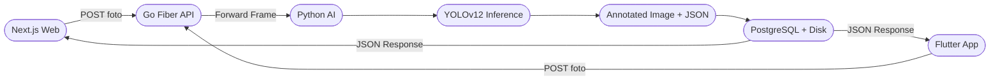

<div align="center">


# OtoScan Web — Hybrid Web Implementation

**OtoScan Web** adalah implementasi **web hybrid** dari [OtoScan AI](https://github.com/fitraaromeo/Otoscan-AI) — sistem inspeksi fisik kendaraan berbasis kecerdasan buatan yang sebelumnya dikembangkan sebagai aplikasi **Flutter Android**. Proyek ini menghadirkan seluruh fitur inspeksi YOLOv12 ke platform web menggunakan **Next.js**, sementara tetap berbagi **backend Go Fiber** dan **database PostgreSQL yang sama** dengan aplikasi Flutter asli.

[Flutter Android App](https://github.com/fitraaromeo/Otoscan-AI) · [Report Bug](https://github.com/fitraaromeo/otoscan-web/issues) · [Request Feature](https://github.com/fitraaromeo/otoscan-web/issues)

</div>

---

## Tentang Proyek Ini

OtoScan Web **bukan** proyek yang berdiri sendiri. Ini adalah **lapisan frontend web** yang dibangun di atas infrastruktur yang sudah ada pada proyek OtoScan AI:

```
OtoScan AI (Ekosistem Penuh)
|
+-- otoscan_app/       -- Flutter Frontend (Android / iOS / Web)  <- Proyek Asli
|
+-- otoscan-web/       -- Next.js Web Frontend                    <- Proyek Ini
|       Menggunakan API & Database yang SAMA dengan Flutter App
|
+-- otoscan-api/       -- Go Fiber REST API + PostgreSQL           <- Backend Bersama
|       GORM / Static File Server / CORS / Cascading Deletes
|
+-- ai-service/        -- Python FastAPI AI Microservice           <- AI Bersama
        YOLOv12 / Bounding Box Annotation / CarDD Dataset
```

> **Tidak ada duplikasi backend.** OtoScan Web terhubung langsung ke Go API (port 8080) dan PostgreSQL yang dijalankan oleh proyek OtoScan AI. Cukup jalankan backend dari repo asli, lalu jalankan Next.js dev server untuk menggunakan versi web-nya.

---

## Alur Data Sistem



---

## Fitur Utama

- **Dashboard Interaktif**: Statistik real-time — Total Klien, Total Kendaraan, Total Sesi Inspeksi, dan Total Temuan AI.
- **Grafik Tren Inspeksi**: Visualisasi tren aktivitas inspeksi dan distribusi jenis kerusakan.
- **Scanner 4 Sisi Kendaraan**: Slot foto untuk Depan (Front), Belakang (Rear), Kiri (Left), Kanan (Right).
- **Kamera Real-time + Live AI Preview**: Buka kamera perangkat langsung dari browser. Aktifkan mode **Live AI** untuk melihat bounding box deteksi kerusakan secara langsung di atas feed kamera tanpa menyimpan data sampai Anda menekan konfirmasi.
- **Upload Foto dari Galeri**: Unggah foto dari penyimpanan lokal dan jalankan deteksi AI YOLOv12 secara otomatis.
- **Deteksi Kerusakan YOLOv12 Otomatis**: Model AI mendeteksi 6 jenis kerusakan fisik:

| Kode            | Jenis Kerusakan  | Ikon |
| --------------- | ---------------- | ---- |
| `dent`          | Penyok / Lekukan | Biru |
| `scratch`       | Goresan / Lecet  | Kuning |
| `crack`         | Retak / Pecah    | Merah |
| `glass_shatter` | Kaca Pecah       | Ungu |
| `lamp_broken`   | Lampu Rusak      | Oranye |
| `tire_flat`     | Ban Kempes       | Abu  |

- **Manajemen Klien & Kendaraan**: CRUD data pemilik kendaraan dan armada.
- **Manajemen Karyawan & Petugas Inspeksi**: Kelola data inspektor yang bertugas.
- **Master Data**: Konfigurasi jenis kerusakan, sudut pengambilan foto, dan status inspeksi.
- **Auto-refresh & Cache Busting**: Foto yang diperbarui langsung terganti di UI tanpa perlu reload manual.

---

## Tech Stack

### Frontend Web — `otoscan-web/` (Proyek Ini)

| Komponen   | Teknologi                               |
| ---------- | --------------------------------------- |
| Framework  | **Next.js 14** (App Router)             |
| Language   | **TypeScript**                          |
| Styling    | **Vanilla CSS** + CSS Custom Properties |
| Icons      | **Lucide React**                        |
| Camera API | **MediaDevices Web API** (getUserMedia) |

### Backend API — `otoscan-api/` (Bersama dengan Flutter App)

| Komponen     | Teknologi              |
| ------------ | ---------------------- |
| Language     | **Go (Golang)** v1.21+ |
| Framework    | **Fiber v2**           |
| ORM          | **GORM**               |
| Database     | **PostgreSQL** 14+     |
| File Storage | Static file server     |

### AI Microservice — `ai-service/` (Bersama dengan Flutter App)

| Komponen  | Teknologi                        |
| --------- | -------------------------------- |
| Language  | **Python** 3.10+                 |
| Framework | **FastAPI** + Uvicorn            |
| Model     | **YOLOv12** (CarDD Dataset)      |
| Libraries | Ultralytics, OpenCV, Pillow      |
| Output    | Annotated JPEG + JSON bbox       |

---

## Cara Menjalankan

> **Prasyarat**: Backend Go API dan Python AI Service dari repo [OtoScan AI](https://github.com/fitraaromeo/Otoscan-AI) **harus sudah berjalan** sebelum menjalankan otoscan-web.

### Step 1 — Jalankan Infrastruktur Backend (dari repo OtoScan AI)

```bash
# Terminal 1 — AI Microservice (port 5000)
cd ai-service
python -X utf8 main.py

# Terminal 2 — Go Fiber API (port 8080)
cd otoscan-api
go run main.go
```

### Step 2 — Clone & Setup OtoScan Web

```bash
git clone https://github.com/fitraaromeo/otoscan-web.git
cd otoscan-web
npm install
```

### Step 3 — Konfigurasi Environment

Buat file `.env.local` di root project:

```env
NEXT_PUBLIC_API_URL=http://localhost:8080/api
```

### Step 4 — Jalankan Development Server

```bash
npm run dev
```

Buka [http://localhost:3000](http://localhost:3000) di browser Anda.

---

## Struktur Project

```
otoscan-web/
+-- src/
|   +-- app/
|   |   +-- (dashboard)/
|   |   |   +-- dashboard/        # Halaman dashboard utama & statistik
|   |   |   +-- inspections/      # Daftar & detail sesi inspeksi
|   |   |   |   +-- [id]/         # Detail inspeksi + scanner 4 sisi + kamera real-time
|   |   |   +-- master/           # Halaman konfigurasi master data
|   |   +-- _components/          # Komponen UI reusable (Modal, Badge, Topbar, Sidebar)
|   |   +-- _lib/
|   |   |   +-- api.ts            # Semua fungsi fetch ke Go API
|   |   |   +-- types.ts          # TypeScript interfaces & type definitions
|   |   +-- globals.css           # CSS variables & design tokens
|   |   +-- layout.tsx            # Root layout & wrappers
+-- public/                       # Static assets
```

---

## API Endpoints yang Digunakan

Semua endpoint ini disediakan oleh Go Fiber API dari `otoscan-api/`:

| Method   | Endpoint                            | Deskripsi                                        |
| -------- | ----------------------------------- | ------------------------------------------------ |
| `GET`    | `/api/inspections`                  | Daftar semua sesi inspeksi (dengan paginasi)     |
| `GET`    | `/api/inspections/:id`              | Detail satu sesi inspeksi                        |
| `POST`   | `/api/inspections`                  | Buat sesi inspeksi baru                          |
| `PUT`    | `/api/inspections/:id`              | Update status / detail inspeksi                  |
| `DELETE` | `/api/inspections/:id`              | Hapus sesi inspeksi (soft delete)                |
| `POST`   | `/api/inspections/:id/detect`       | Upload foto + jalankan YOLOv12 (simpan ke DB)    |
| `POST`   | `/api/inspections/detect-preview`   | Preview YOLOv12 **tanpa simpan ke DB** (Live AI) |
| `GET`    | `/api/vehicles`                     | Daftar kendaraan                                 |
| `GET`    | `/api/users`                        | Daftar klien / pemilik kendaraan                 |
| `GET`    | `/api/employees`                    | Daftar karyawan / inspektor                      |
| `GET`    | `/api/master/damage-types`          | Master jenis kerusakan                           |
| `GET`    | `/api/master/angle-captures`        | Master sudut pengambilan foto                    |
| `GET`    | `/api/master/inspection-statuses`   | Master status inspeksi                           |

---

## Branch

| Branch                    | Deskripsi                                         |
| ------------------------- | ------------------------------------------------- |
| `main`                    | Versi stabil                                      |
| `feature/realtime-camera` | Fitur kamera real-time + Live AI preview (aktif)  |

---

## Author

**Fitra Romeo Winky**

[](https://github.com/fitraaromeo)
[](https://www.instagram.com/fitraaromeo)
[](https://www.linkedin.com/in/fitra-winky-380836266/)
[](https://portfolio-fitra-romeo-winky.vercel.app/)

---

## License

Distributed under the **MIT License**. See `LICENSE` for more information.

---

<div align="center">
  Made with love using Next.js / Go Fiber / Python FastAPI / YOLOv12
  <br/>
  <sub>Web hybrid implementation of <a href="https://github.com/fitraaromeo/Otoscan-AI">OtoScan AI</a> — originally built for Flutter Android</sub>
</div>
